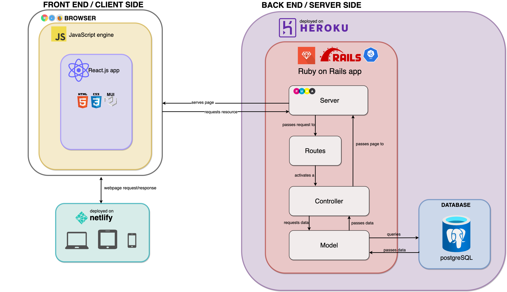
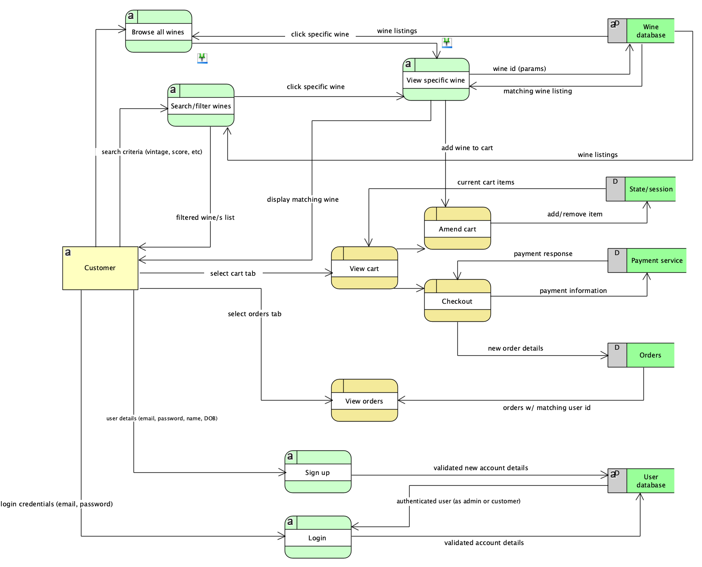
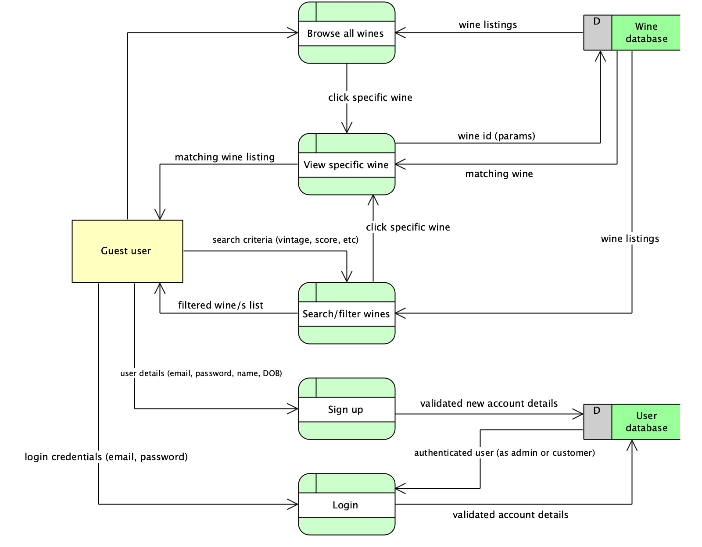
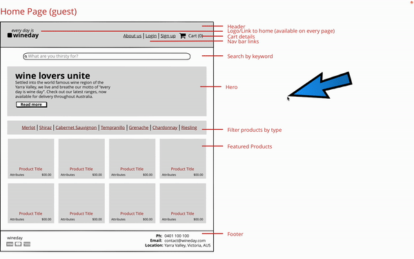
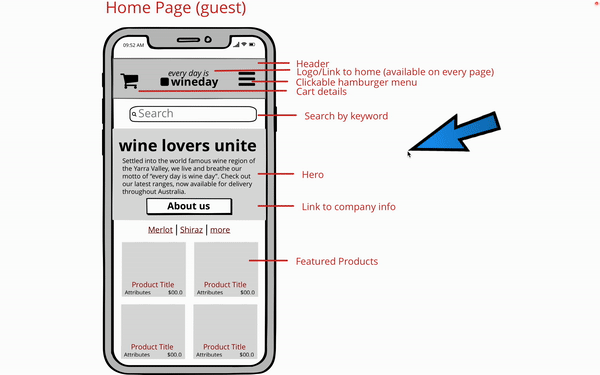

# **T3A2 (Part A) Documentation**

# *Table of Contents*
- [Purpose](#purpose)
    - [Functionality and Features](#functionality-and-features)
        - [All Users](#all-users)
        - [Customer](#customer)
        - [Potential Future Features](#potential-future-features)
    - [Target Audience](#target-audience)
    - [Tech Stack](#tech-stack)
    - [User stories](#user-stories)
    - [Application Architecture Diagram](#application-arhitecture-diagram)
    - [Dataflow Diagrams](#dataflow-diagrams)
        - [Customer](#customer)
        - [Guest](#guest)
    - [Wireframes](#wireframes)
        - [Mobile](#mobile)
        - [Desktop](#desktop)

## **Purpose**
This developer was an approached by a wine retailer, *WineDay*, based in the Yarra Valley. 

The successful family-run business has survived the last 20 years on good management, wonderful reviews, word-of-mouth, a catchy slogan (*"**every**day is WineDay"*) in person sales & wine demonstrations, but alas, COVID-19 has had a dramatic impact on their profitability. 

After securing a contract with a freight company for domestic deliveries, the key decision makers requested the development of an online store to boost: 
1. wine sales,
2. reach of their products, and
3. marketability of their brand to a wider audience

> *Small disclaimer: this didn't happen, and this business doesn't exist.✨*

The app's purpose is to fulfil the needs of the business as stated above. Simply, it will utilise a database of available wine with specific attributes (i.e. varietal, region, price, score, etc) and allow users to filter and search by these. The user will also be able to sign up,  make purchases and see their order history. 

If time allows, for this project, a user will also be able to save their wine preferences and the app will be able to give them new wine recommendations based on that. 

## **Functionality and Features**
The below are features associated with the first-stage MVP development of the WineDay app. 

### **All users**
Anyone that visits the WineDay site will be able to access the following features: 

- Information about the business (about us, contact details, etc)
- Search for a wine by keywords
- Filter wines by region/price/score/varietal
- Sign up for an account
- Log into an account
 
### **Customer**
Additionally, once authenticated, a logged in customer can:

- Add wine to cart
- Remove wine from cart
- Check out
- Log out
- View order history

### **Potential future features**
- Create a admin profile that has exclusive authority to update/delete/add new wine listings & view/amend user profiles.
- A logged in user can add their wine preferences to their profile & recommendations can be made by the app based on this
- Add "just in" tab for new wines
- Add "recommended" tab for recommended wines
- Add "food pairings" tab for recommended food pairings
- Search wines by description ("dry", "fruity")

## **Target Audience**

The target audience is anyone that likes wine (so, a wide scope) that is also in the delivery/pickup region of WineDay (i.e., people based in Australia, at this stage). This includes both potential customers looking to make a purchase and existing customers either checking on orders or making additional purchases. In future revisions of the app, this scope will expand to include people looking for recommendations of wine based on their preferences.  

Additionally, on the business-side, the target audience also extends to the employees of WineDay who can use a user-friendly UI to see stock levels when interacting with customers in store. 

Lastly, if an admin user profile is implemented in the MVP version of this app, it will also include the person/s in charge of maintaining wine listings and user profiles on the app. 

## **Tech stack**

|Front-end|Back-end|Database|Project Management|Utilities|DevOps|
|--|--|--|--|--|--|
|React.js|Ruby (v2.7.5p203)|PostgreSQL|Trello|Draw.io|GitHub|
|JavaScript|Rails (v6.1.6)|||Balsamiq|VSCode|
|CSS3||||Visual Paradigm||
|HTML5||||||
|Material-UI||||||

## **User Stories**

|As a|I want to|so that I can                         |
|----------------|-------------------------------|-----------------------------|
|Customer|be able to browse all available wines|see what is available at a glance to be able to decide what to purchase
|Customer|see company information about WineDay|to assess company history, location, delivery areas and trustworthiness as a vendor
|Customer|search for a wine by a particular keyword|find a wine quickly instead of scrolling for a long time
|Customer|filter wines by attribute (region, vintage, region, etc)|streamline my wine purchasing decisions & help the decision process if I am not sure exactly which wine to buy
|Customer|add and remove items from my cart|change my mind if I don't want to commit to a purchase or add more that I do want
|Customer|securely check out items in my cart|make a purchase of my desired wines
|Customer|view my order history|to keep track of what I have ordered in the past and what I do/don't want to order again
|Customer|log in and out|to track my purchases and keep my account private and secure
|Admin|log in and out|securely access the admin-only dashboard and log out when done to maintain security
|Admin|view/create/amend/delete user profiles|to make necessary changes or sign up new customers
|Admin|view/create/amend/delete wine listings|to fix errors or make necessary stock changes as required by the business

> 🧁 *Note:* the admin user role is a sprinkle at this stage, and not intentionally being developed in the MVP (unless time permits).

## **Application Architecture diagram**

## **Dataflow diagrams**
### Customer

Dataflow (role: guest)
Anyone who visits the site will be able to have access to search/browse/filter functionality, but will be prompted to log in/sign up if they want to add things to their cart and check out. 

### Guest

## **Wireframes**
Two screen sizes have been designed to reflect the UX/UI of the application, desktop and mobile. The tablet view will likely be a mid-point between the two, with the specifics being decided upon user testing (i.e. whether to implement a nav bar menu or a hamburger menu, etc).

A demonstration of how a user will interact with the application is available for both mobile and dekstop in *.gif* form below. In addition, screenshots of each page have been created and annotated.

### **Desktop**

   
  
ClICK to view wireframe screenshots for desktop

  
  
  
  
  
  
  
  
  
  
  
  
  
  

### **Mobile**

  
ClICK to view wireframe screenshots for mobile

  
  
  
  
  
  
  
  
  
  
  
  
  
  
  
  

  

  

## Project management workflow (Trello)

